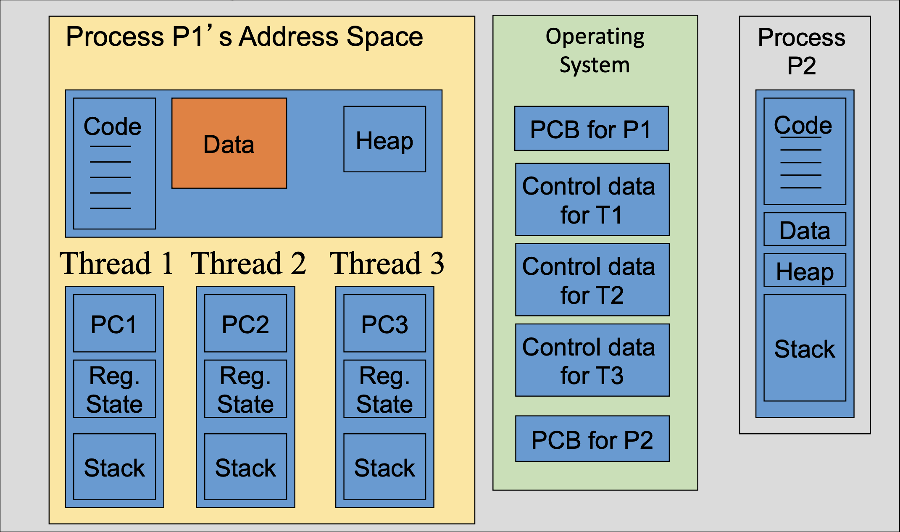
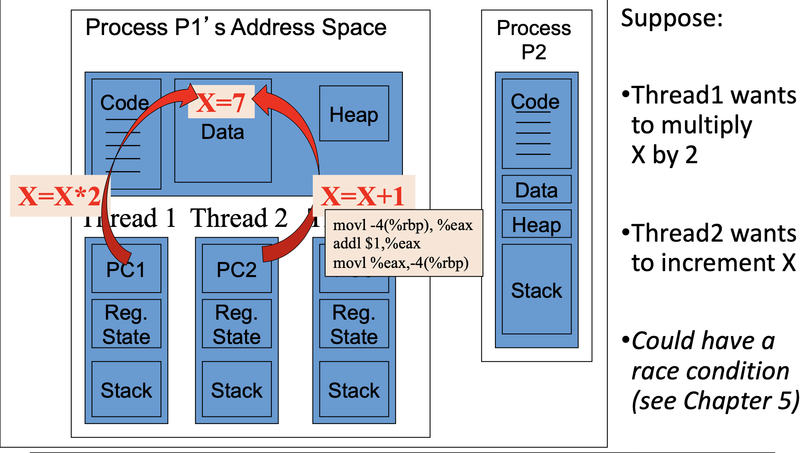
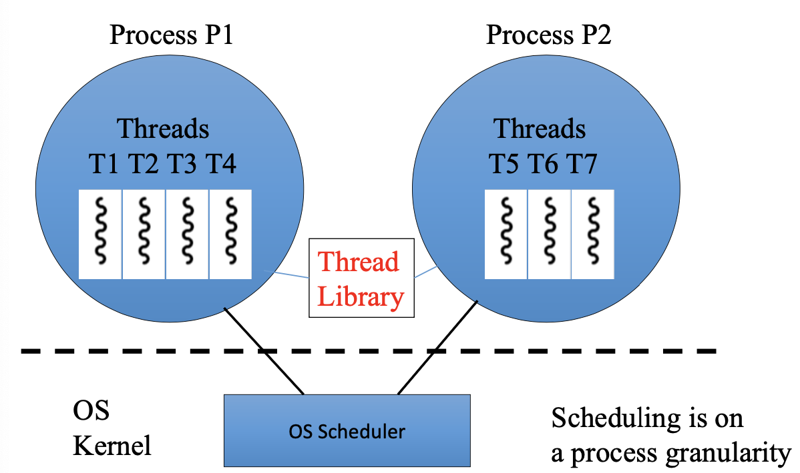
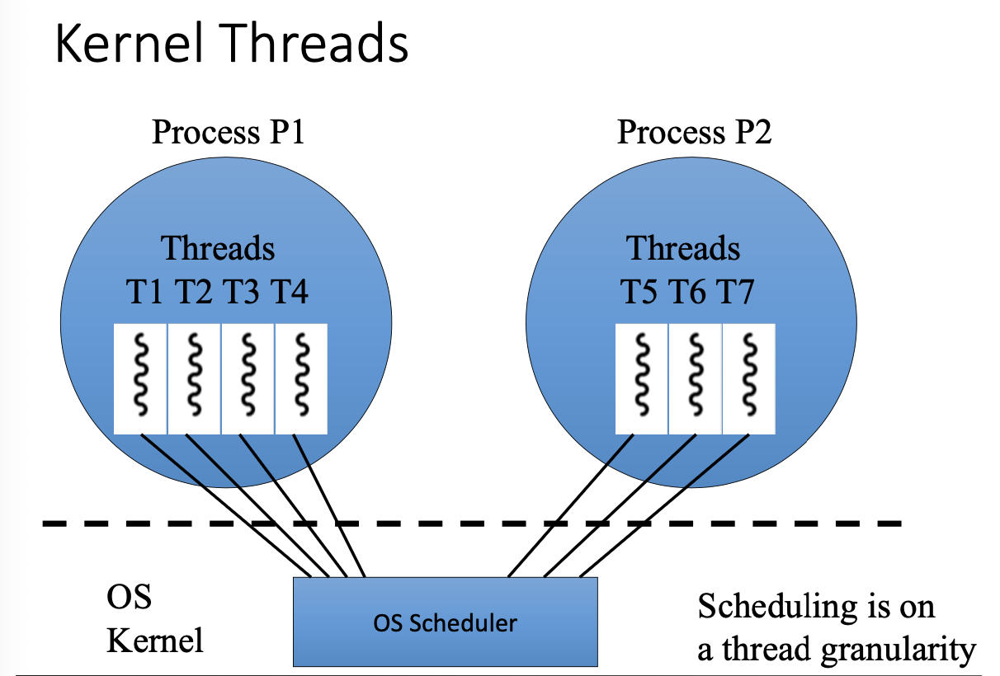
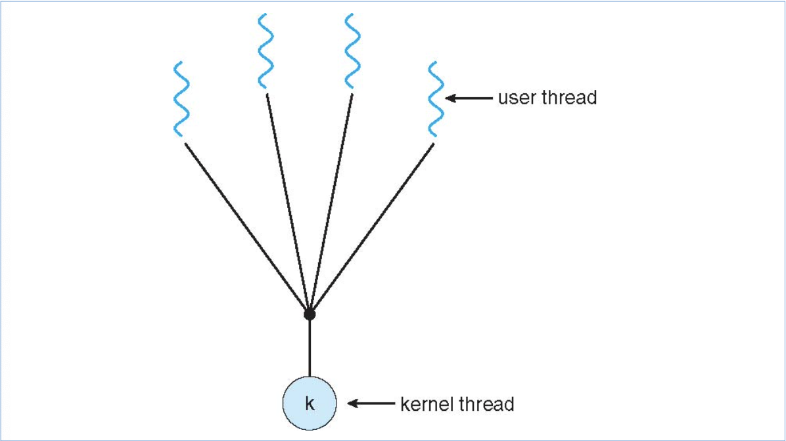
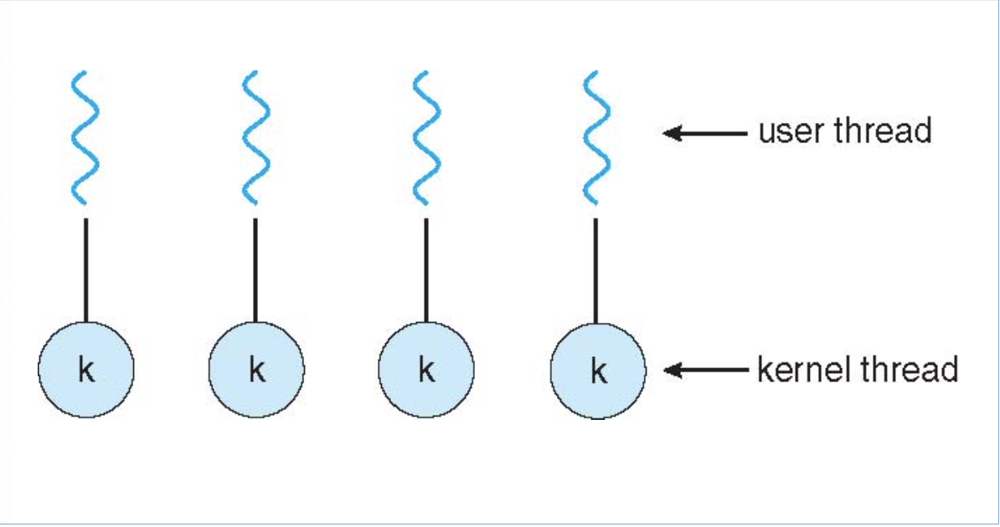
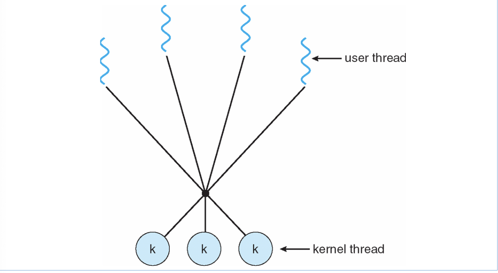

# Inter Process Communication

### Signals

- OS to process
- Inter-process
- Intra-process 

### Message Passing

- Pipes 
- Sockets

### Sharing Data with Multiple Processes

#### Duplication of a Process

- When process 2 is a `fork()` of process 1, what actually needs to be copied? 
  - Code is identical - no need to copy, just share 
  - data is the same - is it ok to just share?
    - Ok to share until data changes
  - "Copy on write" - will share until changed and then create its own copy

#### IPC Shared Memory

- OS provides mechanisms for the creation processesof a shared memory buffer between processes (both processes have address mapped to their process)

- Applies to processes on the same machine

- Problem: shared access introduces complexity

  - Need to sumchronize access

  ##### IPC Shared memory (Linux)

  - `shmid = shmget(key name, size, flags)` is part of the Posix API (missing notes here)
  - `shmctl()` to modify control info and permissions relation to a shared memory segmend && to remove a shared memory segment 
  - `shm_ptr=shmat(shims, NULL, 0)` to attach a shared memory segment to a process's address space
    - This association is also called binding
    - Reads and writes now just use `shm_ptr`

# Threads (AKA 'Lightweight processes')

### Why do we want to use Threads? 

- Reduced context switch overhead vs multiple processes
  - Eg. in Solaris (Linux BigIron), context switching between processes is 5x slower than switching between threads
  - Don't have to save/restore context, including base and limit registers and other MMu registers, also TLB cache doesn't have top be flushed
- Shared resources => less memory consumption
  - Don't duplicate code, data, or heads, or have multiple PCBs as for multiple processes
  - Supports more threads - more scalable, e.g. Web server must handle thousands of connections
- Inter-thread communication is easier and faster than inter-process communication
  - threads share the same memory space, so just read/write from/to the same memory location
  - IPC via message passing uses system calls to send / recieve a message, which is slow
  - IPC using shared memoery may be comparable to inter-thread communication

### Thread Safety

#### Thread Safe Code

- A piece of code is **thread-safe** if it functions correctly suring the simultaneous or *concurrent* execution by multiple threads
  - In particular, is must satisfy the need for multiple threads to access the same shared data, and the need for a shared piece of data to be accessed by only one thread at any given time
- If two threads share and execute the same code, then unprotected use of shared: 
  - global variables is not thread safe
  - static variables is not thread safe
  - Heap variables is not thread safe
- If possible, best to avoid globals for thread safety, but there is a way to do so safely

### Processes vs Threads

- Why are processes still used when threads bring so many advantages?
  1. Some tasks are sequential and not easily parallelizable, and hence are single-threaded by nature
  2. No fault isolation between threads
     - If a thread crashes, it can bring down other threads
     - If a process crashes, other processes continue to execute, because each process operates within its own address sapce, and so one crashing has limited effect on another
     - ***Caveat***: a crashed process may fail to release synchronization locks, open files, etc., thus affectign other processes. But, the OS can use PCB's information to help cleanly recover from a crash and free up resources. 
- Writing thread safe / reentrant code is difficult. Processes can avoid this by having sepearate address spaces and separate copies of the data and heap.
- Advantages of multithreading:
  - Sharing between threads is easy
  - Faster creation
- Disadvantage of multithreading:
  - Ensure threads-safety
  - Bug in one thread can bleed to other threads since they share the same address space
  - Threads must compete for memory
- Considerations:
  - Dealign with signals in threads is tricky
  - All threads must run the same program
  - Sharing of files, users, etc

### Applications, Processes, and Threads

- An application can consist of multiple processes, each one dedicated to a specific task (UI, computation, communication, etc.)
- Each process can consist of multiple threads
- An application could thus consist of many process and threads

### Thread Libraries

- Thread library provides programmer with API for creating and managing threads
- Two primary ways of implementing
  - Library entirely in user space
  - Kernel-level library supported by the OS
- Three main thread libraries in use today:
  - POSIC Pthreads
    - May be provided either as a user-level or kernel-level
    - A POSIX standard (IEEE 1003.1c) API for thread creation and synchronization
    - API specifies behavior of the thread library, implementation is up to development of the library
  - Win32
    - Kernel-level library on Windows system
  - Java
    - Java threads are managed by the JVM
    - Typically implemented using the threads melel privided by underlying OS

### The pthreads API

- Thread management: the first class of fucntions work directly on threads - creating, terminating, joining, etc.
- Semaphores: provide for create, destroy, wait, and post on semaphores
- Mutexes: provide for creating, destroying, locking, and unlocking mutexes
- Condition variables: include functions to create, destroy, wait, and signal based upon specified variable values

#### Thread Creation

`pthread_create(did,attr,start_routine,arg)`

- It returns the new thread ID via the TID argument
- The attr parameter is used to set thread attributes, NULL for the default values
- The `start_routine` is the C routine that the thread will execute once it is created
- A single argument may be passed to `start_routine` via `arg`. It must be passed by reference as a pointer cast of type void. 

#### Thread Termination and Join

`pthread_exit(value);`

- This function is used by a thread to terminate 

- The return value is passed as a pointer

  `pthead_join(tid,value_ptr);`

- The `pthread_join()` subroutine blocks the calling thread until the specified *threadid* thread terminates.

- Return 0 on success, and negative on failure. The returned value is a pointer returned by reference. If you do not care about the return value, you can pass NULL for the second argument.

### User-Space Threads

- User-space threads are usually cooperatively multitasked, i.e. user threads within a process voluntarily give up the CPU to each other
  - Threads will synchronize with each other via the user-space threading package or library
  - Thread library: provides interface to create, delete threads in the same process
- OS is unaware of user-space threads - only sees user-space processes
  - If one user-space thread blocks, the entire process blocks in a many-to-one scenario (see text (where?))
- `pthreads` is a POSIX threading API
  - Implementation of `pthreads` api differ underneath the API; could be user-space threads; there is also a pthreads support for kernel threads as well
- User-space thread is called a *fiber*

### Kernel Threads

- *Kernel threads* are supported by OS
  - Kernel sees threads and schedules at the granularity of threads
  - Most modern OSs like Linux, Mac OS, && Windows support kernel threads
  - Mapping of user-level threads to kernel threads is usually one-to-one, e.g. Linux && Windows, but could be many-to-one, or many-to-many
  - Win32 thread library is a kernel-level thread library

#### Many-to-One Model

#### One-to-One Model

#### Many-to-Many Model

# Aside About Problem Sets

- Apparently critical to exams
- Worth 5% total grade
- Can look up answers after first attempt, but worth understanding everything

