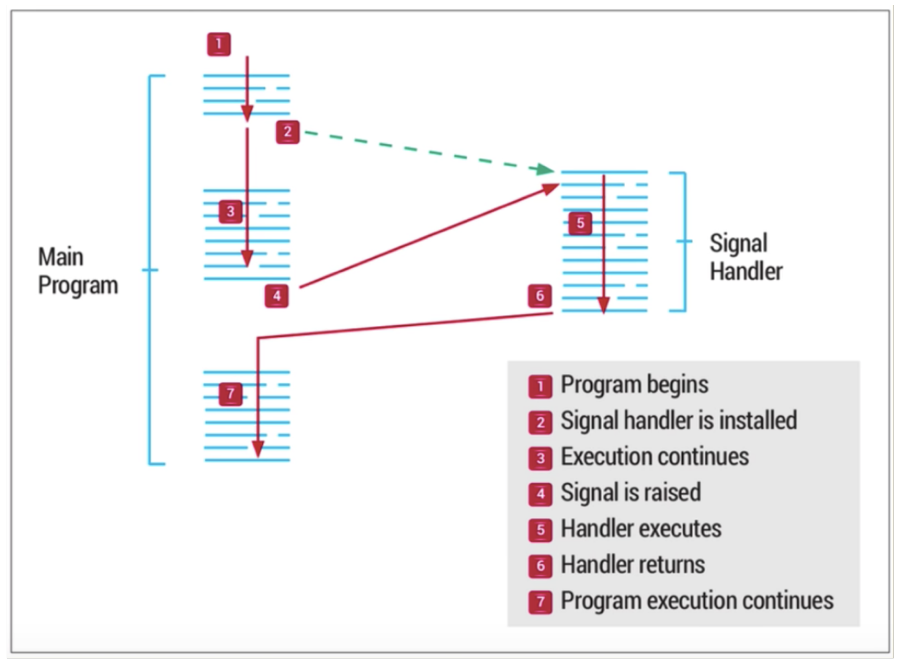
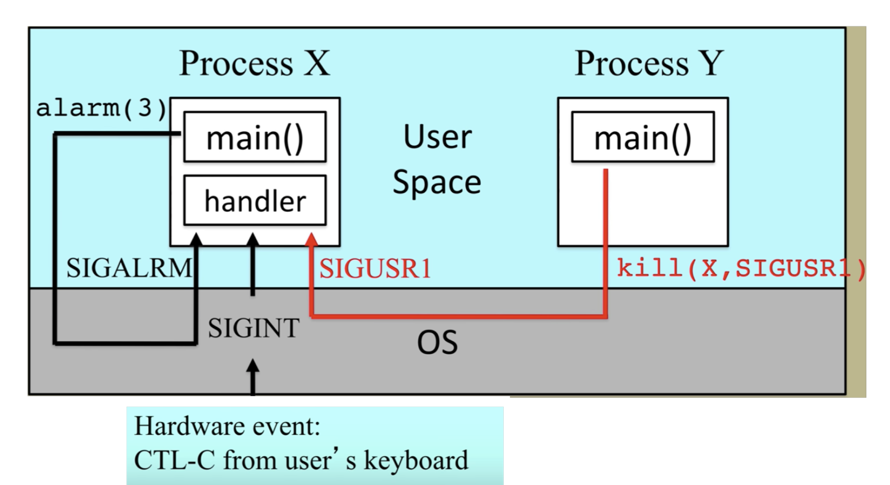
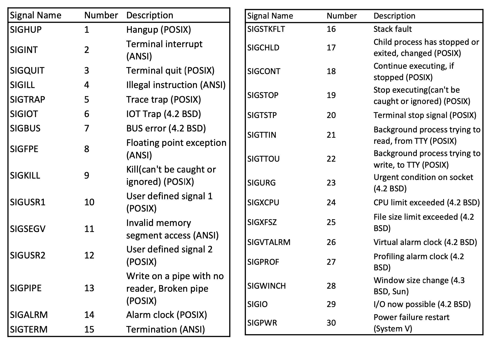
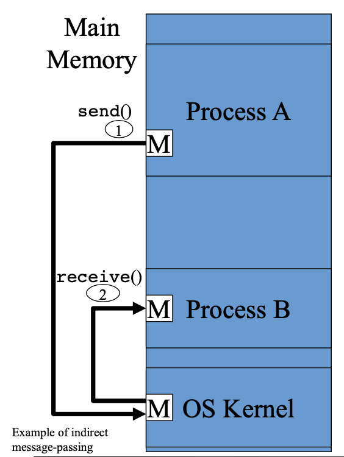
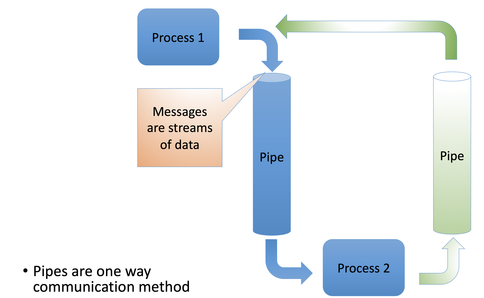
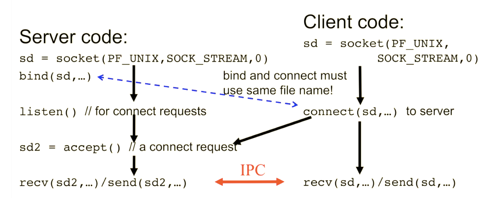
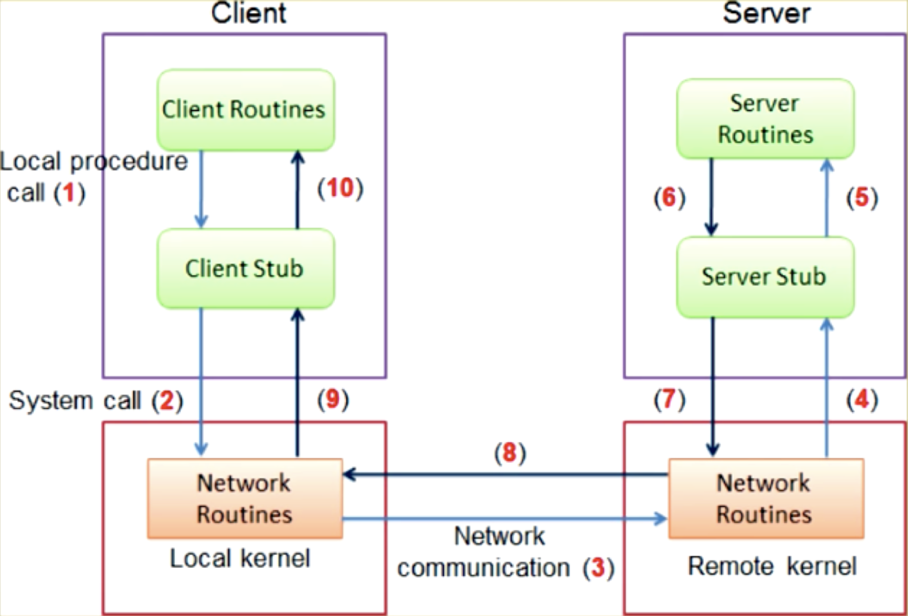
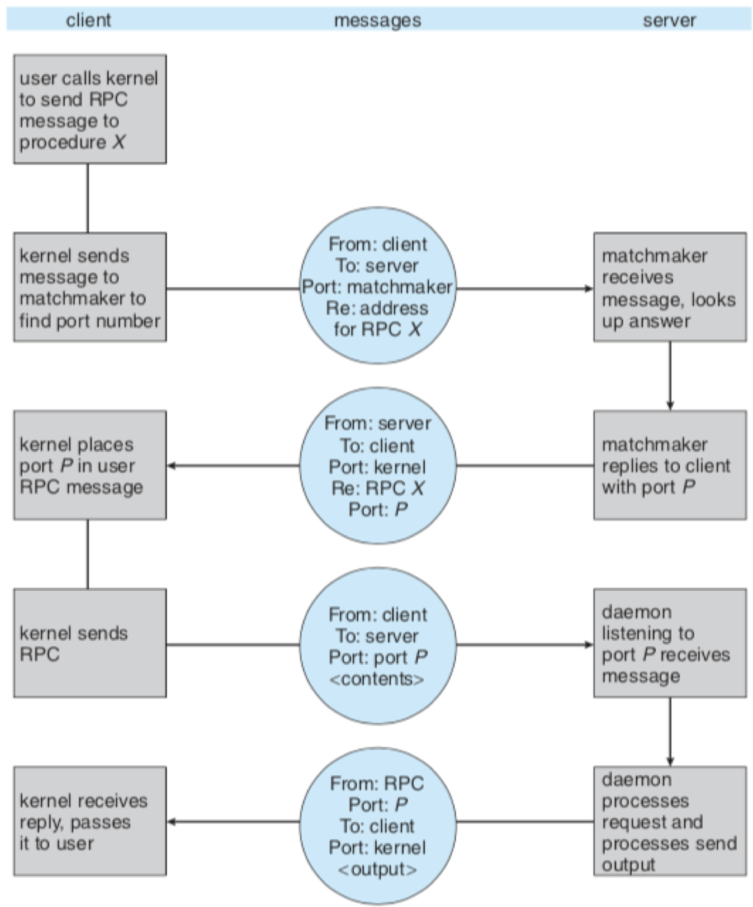

# Inter-Process Communication (IPC)

- Processes within a system may be independent or cooperating
- cooperating processes can affect or be affected by other processes , including sharing data
- Reasons for cooperating processes: 
  - Information sharing
  - Computation speedup
  - Modularity
  - Convenience
- Cooperating processes need interprocess communication (IPC)
- Two models of IPC:
  - Message passing
  - Shared memory

## Signals

- Kernel-to-Process:
  - Kernel sets the numerical code in a process variable (generally contained in PCB), then wakes the process up to handle the signal
- Process-to-Process
  - Call `kill(process_id, signal_num)`
    - e.g. `kill(Y,SIGUSER1)` send a `SIGUSER1`signal to process `Y` which will know how to interpret this signal
    - Call still goes through kernel, not directly from process to process
  - A process can send a signal to itself using a library call like `alarm()`
- If a process ***catches*** a signal, it means that it (the process) includes code that will take appropriate action when the signal is received
- If the signa is not caught by the process, the kernel will take ***default action*** for the signal
- Not much information can be passes through signals (I think this is a bit limitation), only that an event has occured

### Signal Handler 

- The handler resides in the same code base as the program

- it is usually a routine to be called when the signal is seen

  

### Signals and Race Conditions

- Signals are an *asynchronous* signaling (communication?) mechanism 

  - A process never knows when a signal will occur

  - Its excecution can be interrupted at any time

  - A process must be written to handle asynchrony, otherwise race conditions could develop

    e.g.

    ```C
    // not sure what is going on here - check lecture recording from 1 Feb
    int global=10;
    
    handler(int signum) {
    
    	global++;
    
    }
    
    main() {
    
    	signal(SIGUSR1,handler);
    
    	while(1) {global--;}
    
    }
    ```

- Multiple signals can also have a race condition 

  - Signal handler is processing signal S1 but is interrupted by another signal S2
  - The solution is to *block* other signals while handling the current signal
    - Use `sigprocmask()` to selectively block other signals
    - A blocked signal is pending
    - There can be at most one pendign signal per signal type, so signals are not queued

### Signal Example (Code)

```C
#include <signal.h>
int beeps=0;

void handler(int sig) {
  if (beeps < 5){
    alarm(3);
    beeps++;
  } else {
    prinf("DONE\n");
    exit(0);
  }
}

int main(){
  signal(SIGALM, handler); //register signal handler
  alarm(3); //cause first SIGALM to be sent to this process in 3 seconds
  
  while(1){;} //infinite loop that gets interrupted by signal handling
  exit(0);
}
```

### Commonly Used Signals 

| Number | Name/Type        | Event                               |
| ------ | ---------------- | ----------------------------------- |
| 2      | SIGINT           | Interrupt from keyboard (ctrl-c)    |
| 8      | SIGFPE           | Floating point error (arith. error) |
| 9      | SIGKILL          | Kill a process                      |
| 10, 12 | SIGUSR1, SIGUSR2 | User-defined signals                |
| 11     | SIGSEGV          | Invalid memory ref (seg fault)      |
| 14     | SIGALRM          | Timer signal from alarm function    |
| 29     | SIGIO            | I/O now possible on descriptor      |

​          

### Signals Allow Limited IPC (Graphic)




### Signals - POSIX-compliant / UNIX (Graphic) (TODO::TABLE)

## 


## Message Passing

- `send()` and `receive()`can be blocking/synchronous or non-blocking/asynchronous

- Used to pass small messages

- Advantages: OS handles synchronization

- Disadvantage: slow

  - OS is involved in each IPC operation for control signaling and possibly data as well

- Message passing IPC types:

  - Pipes
  - UNIX-domain sockets
  - Internet domain sockets
  - Message queues
  - Remote procedure calls (RPC)

  




### Blocking vs Non-Blocking I/O

- Blocking system call
  - Process put on wait queue until I/O read or write completes
  - I/O command succeeds completely or fails
- Non-blocking system call
  - A write or read returns immediatly with partial number of bytes transferred (possibly 0)
  - e.g keyboard, mouse, network sockets
  - Makes the application more complex
    - not all the data may have been read or writen in single cell
    - have to add additional code to handle this, like a loop

### Synchronous vs Asynchronous 

- Synchronous will make the request I/O and not continue until the command is completed
  - Often synchronous and blocking are used interchangeably
- Asynchronous returns immediately (like non-blocking)
  - Often asynchronous and non-blocking are used interchangeably
  - In asynchronous write I/O, at some later time, the full nuymber of bytes requested is transferred
  - Subtle difference with non-blocking definition
  - Can be implemented using signals and handlers

### Pipes

#### Ordinary Pipes

- Ordinary pipes allow communication in a producer-consumer style
- Producer writes to one end (the write-end of the pipe)
- Consumer reads from the other end (the read-end of the pipe)
- Ordinary pipes are unidirectioonal, we'll need two for full-duplex
- Generally require parent-child relationship between communicating processes

#### Named Pipes

- Traditional one-way or anonymous pipes only exist transiently between the two processess connected by the pipe
  - As soon as these processes complete, the pipe disappears
- Named pipes persist across processes
  - Operate as FIFO buffers or files, e.g. created using `mkfifo(unique_pipe_name)` on Unix
  - Different processes can attatch to the named pipe to send and recieve data
  - Need to explicitly remove the named pipe
  - In some OS's named pipes can be bi-directional, but not in Linux

#### IPC Via Pipes (Graphic)



### Sockets

- Sockets are an example of message-passing IPC. Created in Unix using `socket()` call.

```C
sd = socket(int domain, int type, int protocol);
// sd is socket descriptor
// domain: PF_UNIX for local sockets, PF_INET for remote sockets
// type:
	//SOCK_STRAM for reliable in-order delivery of a byte stream
	//SOCK_DGRAM for delivery of discrete messages
// protocol: 0 to select default protocol associated with a type

```

#### Using Sockets for UNIX IPC

- `PF_UNIX` domain
  - Used only for local communication among a computer's processes
  - Emulates reading/writing from/to a file
  - Each process `bind()`'s it's socket to a filename:

```C
bind(sd, (struct sockaddr *)&local, length);
/*
- sd is socket descriptor
- Local is a data structure containing unique unised file name, e.g. 	
"/users/name/my_ipc_socket_file"
*/
```

- Usually, one process acts as the server, and the other processes connect to it as clients



### Remote Procedure Calls (RPC)

1) Client makes a call to a function and passes parameters
2) The client has linked a stub for the function. thus stub will marshal (packetize) the data and send it to a remote server
3) The network transfers the information to a server
4) A service listening to the netwrok recieves a request
5) The information is unmarshalled (unpacked) and the server's function is called
6) The results are returned to be mrshalled into a packet
7) The network transfers the packet back to the client
8) TCP/IP used to transmit packet



- Can fail more often
- Can be executed more than once
  - Exactly once vs at most once (not sure what this means)
  - Timestamped message record is needed for "at most once"
  - An ACK protocol is needed for "exactly once"
- Remote port selection
  - Static port => Pre-selected
  - Dynamic port => matchmaker is needed



# Inter Process Communication

### Signals

- OS to process
- Inter-process
- Intra-process 

### Message Passing

- Pipes 
- Sockets

### Sharing Data with Multiple Processes

#### Duplication of a Process

- When process 2 is a `fork()` of process 1, what actually needs to be copied? 
  - Code is identical - no need to copy, just share 
  - data is the same - is it ok to just share?
    - Ok to share until data changes
  - "Copy on write" - will share until changed and then create its own copy

#### IPC Shared Memory

- OS provides mechanisms for the creation processesof a shared memory buffer between processes (both processes have address mapped to their process)

- Applies to processes on the same machine

- Problem: shared access introduces complexity

  - Need to sumchronize access

  ##### IPC Shared memory (Linux)

  - `shmid = shmget(key name, size, flags)` is part of the Posix API (missing notes here)
  - `shmctl()` to modify control info and permissions relation to a shared memory segmend && to remove a shared memory segment 
  - `shm_ptr=shmat(shims, NULL, 0)` to attach a shared memory segment to a process's address space
    - This association is also called binding
    - Reads and writes now just use `shm_ptr`