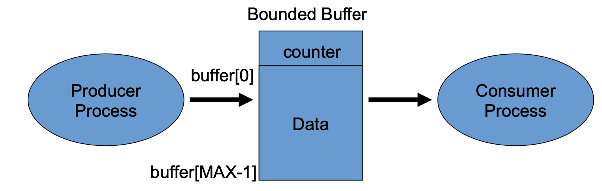
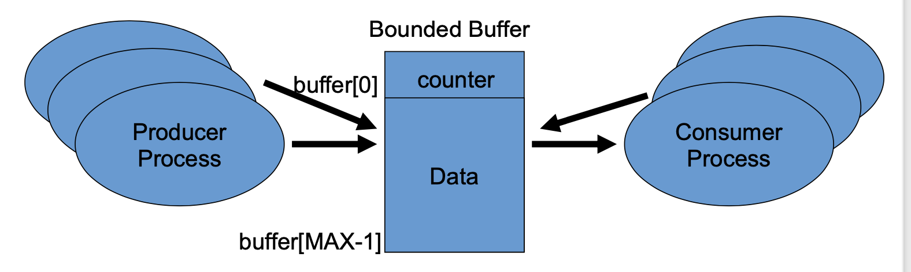
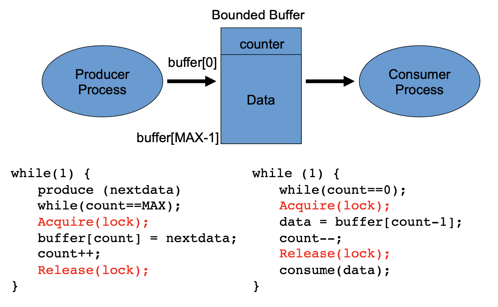
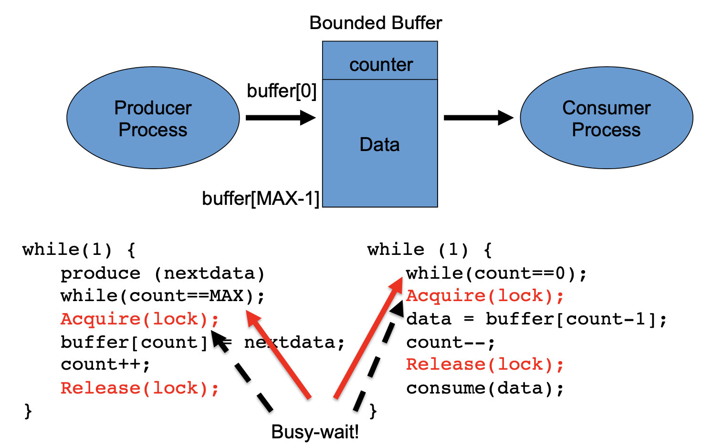
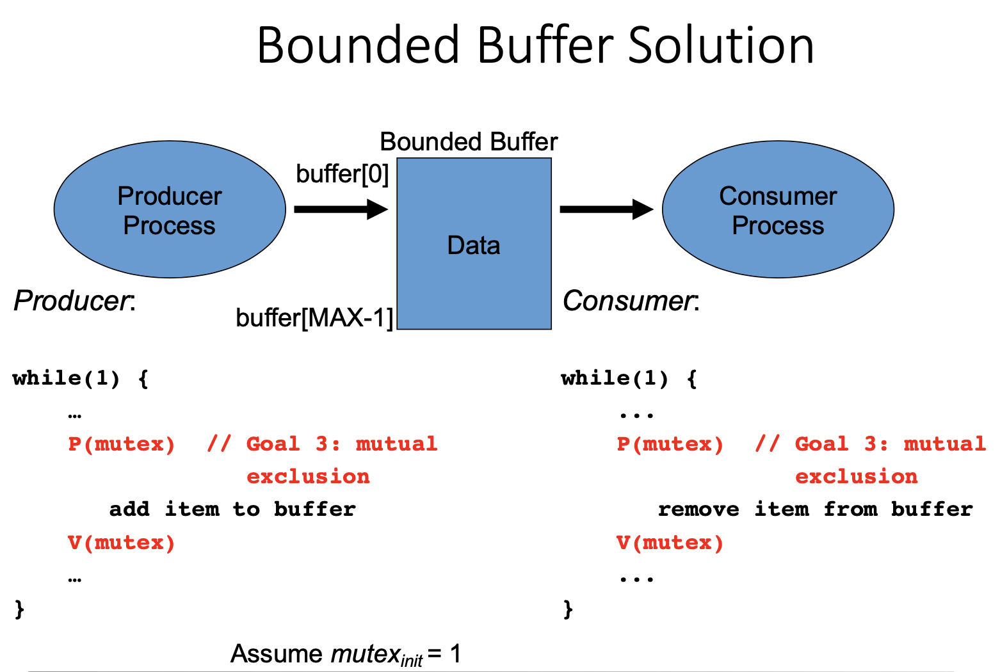
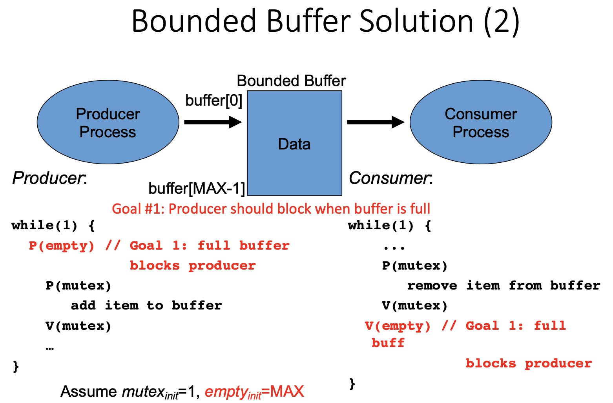
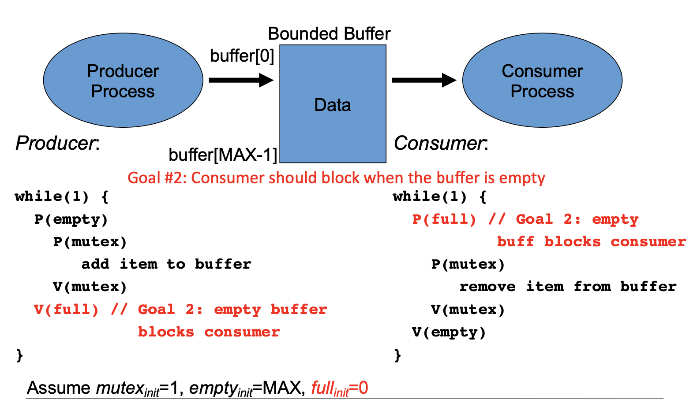
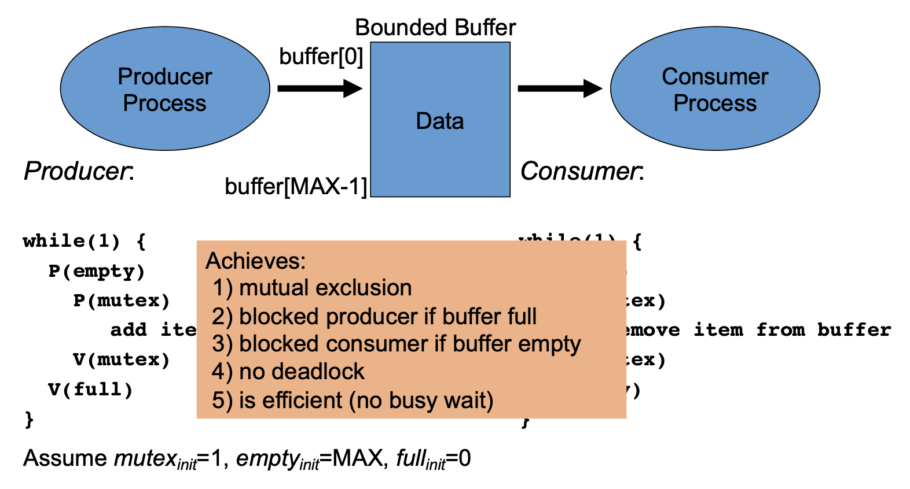
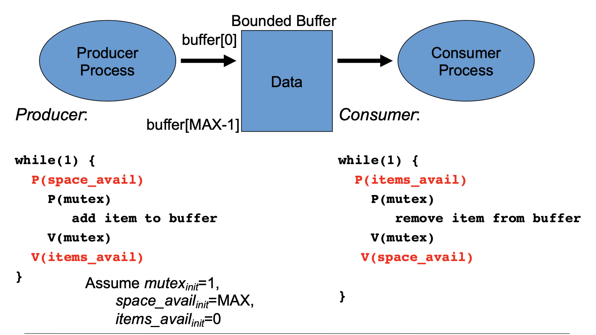

# Semaphores

- Dijkstra proposed more general solution to mutual exclusion
- Semaphore S is an abstract data type that is accessed only though two standard atomic operations
  - `wait()` (also called `P()` from Dutch word *proberen* "to test" )
    - somewhat equivalant to a test-and-set
    - also involves *decrementing* the value of S
  - `signal()`(`V()` from Dutch word *verhogen* "to increment")
    - Increments the value of S
- OS provices ways to create and manipulate semaphores automatically 


### Semaphore (code)

```C
typedef struct {
  int value;
  PID *list[];
} semaphore;
```

```C
wait(semaphore *s){
  s-> value--; //process attempting to enter critical section of code 
  if(s->value<0){
    add this process to s->list;
    sleep();
  }
}
```

```C
signal(semaphore *s){
  s-> value++; // process is going to leave critical section of code
  if(s->value <= 0){
    remove a process P from s->list; //if there is room, wakeup the next process attempting to enter room
    wakeup(P);
  }
}
```

- Analogous to a bouncer with a clicker outside a club - allows only `value` number of processees to enter critical section of code

```C
semaphore S = 1; //initial value of semaphore is 1
int counter; //assume counter is set correctly somewhere is code

//process P1
wait(S);
	// execute critical section
	counter ++;
signal(S);

//process P2
wait(S);
	// execute critical section
	counter --;
signal(S);
```

- Both processes atomically `wait()` and `signal()` the semaphore S, which enables mutual exclusion on critical seciton code

## Problems with Semaphores

### Deadlock

```C
global int R1, R2;
semaphore Q = 1; //binary semaphore as a mutex lock for R1
semaphore S=1; //binary semaphore as a mutex lock for R2


//process P1
wait(S); // 1
wait(Q); // 3

modify R1 and R2;

signal (S);
signal (Q);


//process P2
wait(Q); //2
wait(S); //4

modify R1 and R2;

signal (Q);
signal (S);

/*
Potential for deadlock! P1 grabs S, P2 grabs Q - then P1 waits for Q to open, and P1 waits for S to open.
More semaphores introduce increasing liklihood that a deadlock can occure. Use as few as possible. 
*/
```

- In the previous example: 
  - Each process will block on a semaphore
  - The `signal()` statements will never get executed, so there is no way to wake up the two processes
  - There is no rule about the order in which `wait()` and `signal()`operations maye be invoked
  - In general, with more processes sharing more semaphores, the potential for dealock grows

### Other Problematic Scenarios

- A programmer mistakenly follows a `wait() `with a second `wait()` instead of a `signal()`
- A programmer forgets and omits the `wait(mutex)` or `signal(mutex)`
- A programmer reverses the order of `wait()` and `signal()`


### Starvation

```C
//code example illustrating potential for starvation  

global int R1, R2;
semaphore S=1; //binary semaphore as a mutex lock for R1 and R2

//Process P1:

wait(S);

modify R1 and R2;

signal (S);


//Process P2:

wait(S);

modify R1 and R2;

signal (S);


//Process P3:

wait(S);

modify R1 and R2;

signal (S);

//Potential for starvation!!
```

- Starvation is the possiblility that a process would never get to run
- For example, in a multi-tasking sytem the resources could switch between two individual processes
- Depending on how the processes are scheduled, a third process may never get to run
- The third task is being starved of accessing the resource


## Semaphore solution for Mutual Exclusion

### Code Example

```C
shared semaphore lock = 1; //initial value of semaphore 1
shared int count;
shared data_type buffer [MAX];

//code for P1

while(1){
  produce (nextdata);
  while(count == MAX); //is this busy wait? 
  wait(lock);
  buffer[count] = nextdata;
  count++;
  signal(lock);
}


//code for P2
while(1){
  while(count == 0); //busy wait?
  wait(lock);
  data = buffer[count -1];
  count --;
  signal(lock);
  consume(data);
}
```

- Busy waiting removed from the mutual eclusion when waiting on lock
- Does it solve all busy waiting issues? 

## `pthread` Synchronization

- Mutex locks
  - Used to protect critical sections
- Some implementations provide semaphores through POSIX SEM extension
  - Not part of pthread standard

```C
#include<pthread.h>

pthread_mutex_t m; //declare a mutex object
phread_mutex_init(&m, NULL); //initialize mutex object

//thread 1
pthread_mutex_lock(&m);
//critical section for th1
pthread_mutex_unlock(&m);

//thread 2
pthread_mutex_lock(&m);
//critical section code for th2
pthread_mutex_unlock(&m);
```

### `pthread` Mutex

- pthread mutexes can have only one of two states: lock or unlock
- Important restriction
  - Mutex ownership: only the thread that locks a mutex can unlock that mutex
  - Mutexes are strictly used for mutual exclusion while binary semaphores can also be used for synchronization between two threads or processes

## POSIX Semaphores

```C 
#include <semaphore.h>

init sem_init(sem_t *sem, int pshared, unsigned int value);
//pshared: 0(among threads); 1(among processes)

int sem_wait(sem_t *sem); // same as wait()

int sem_post(sem_t *sem);//same as signal()

sem_getvalue(); //check the current value of the semaphore
sem_close(); //done with the semaphore then close
```

## Producer-Consumer Problem

**Also known as the Bounded Buffer Problem**

- We have already seen this problem with one producer and one consumer
- General problem: **multiple** producers and multiple consumers
- **Producers** put new information in the buffer
- **Consumers** take information from the buffer

### Prior Bounded-Buffer P/C Approach



- Produer places data into a buffer at the next available position
- Consumer takes information from the earliest item










### Bounded-Buffer Goals

- In the prior approach, both the producer and consumer are ***busy-waiting*** using locks
- Instead, want both to sleep as necessary
  - Goal #1: Producer should block when buffer is full
  - Goal #2: Consumer should block when the buffer is empty
  - Goal #3: Mutual exclusion when buffer is partially full
    - Producer and consumer should access the buffer in a synchronized, mutually exclusive way











### Bounded Buffer Design

- **Goal #1: Producer should block when buffer is full**
  - USe a counting semaphore called `empty` that is initialized to `empty_init = MAX`
  - Each time the producer adds an object to the buffer, this decrements the # of empty slots, until it hits 0 and the producer blocks
- **Goal #2: Consumer should block when the buffer is empty**
  - Define a counting semaphore `items_avail` that is initialized to `items_avail_init = 0`
  - `items_avail` tracks the # of full slots and is incremented by the producer
  - Each time the consumer removes a full slot, this decrements `items_avail`, until it hits 0, then the consumer blocks
- **Goal #3: Mutual exclusion when buffer is partially full**
  - Use a mutex semaphore to protext access to buffer manipulation, `mutex_init = 1`

### Code Block (Key Idea for PA3)

```C
//Producer
while(1){
  P(space_avail) //semaphore
    	P(mutex)
    		add item to buffer
    	V(mutex)
  V(items_avail) //semaphore
}

//Consumer
while(1){
  P(items_avail)//semaphore
    	P(mutex)
    		remove item from buffer
    	V(mutex)
  V(space_avail)//semaphore
}
```


# Aside: PA3

- Last slide of lecture 10 slides has critical idea for PA3sa