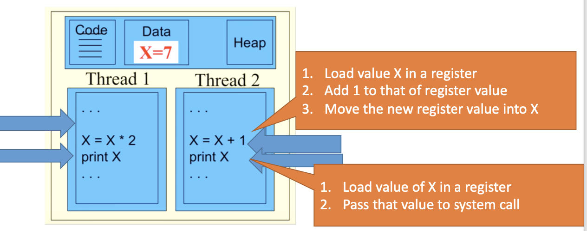

# Thread Safety && Reentrancy

## Multiple Threads

### Main Memory (Graphic)


### Benifits of Multithreaded Architecture

- Responsiveness
  - Useful for interactive applications
- Resource Sharing
  - Memoery and resources are shared within process
- Context-switching overhead
  - Low crreating and managing overhead
- Scalability
  - Trheads can run in **parallell** with multicore system

### Example (Graphic)


## Thread Safety

- Thread Safe
  - If the code bahaves correctly during **simultaneous** or ***concurrent***execution by multiple threads
- Reentrant
  - If the code bahaves correctly when a ***single*** thread is interrupted in the middle of executing, the code reenters the same code

### Main Memory


Suppose: 

- Thread1 wants to multiply X by 2
- Thread2 wants to increment X
- Could have a ***race condition***

### Not Thread Safe (Example)

- Given the following code, what are the possible values that are printed: 


### Thread-Safe Code

- Code is **thread-safe** if it behaves correctly during simultaneous or *concurrent* execution by multiple threads
  - Multiple threads accessing the same shared data can cause different values to be used in different threads (**race condition**)
  - Can be thread safe if each piece of **shared data can only be accessed by one thread at a given time**
- If two threads share and execute the same code, then it is not safe to use the following unprotected **shared** data:
  - Use of global variables is not thrad safe
  - Use of static cariables is not thread safe
  - Use of heap variables is not thread safe

### Reentrant Code

- Code is reentrant if a **single thread** (really a sequence of execution) can be interrupted in the middle of executing the code **and** then reenter the same code later in a safe manner (before the first entry has been completed).


- Reentrancy was developed for interrupt service routines (ISRs)
  - In the middle of a OS processing an interrupt, its ISR can be interrupted to process a second interrupt
  - The same OS ISR code may be reentered a 2<sup>nd</sup> time before the 1<sup>st</sup> interrupt has been fully processed.
  - IF the ISR coe is not well-written, i.e., reentrant, then the system could hang or crash. 

#### Reentrancy Example (Code)

##### Neither Reentrant Nor Thread-safe

```C
int tmp;

void swap(int* x, int* y)
{
  tmp = *x;
  *x = *y;
  *y = tmp;
}

void isr()
{
  int x = 1, y = 2;
  swap(&x, &y);
}
```

- Must limit access to one thread at a time

  ```C
  function f() {
    lock(); // gives this thread exclusive use, keeps all other threads waiting
    change global variable G;
    unlock (); // give use to another thread
  }
  /* this code is NOT reentrant because if f() is interrupted just before the unlock(), and f() is called a 2nd time, the system will hang, because the 2nd call will try to lock, then be unable to lock, because the 1st call had not yet unlocked the system
  ```

##### Reentrant and Thread-safe

```C
void swap(int *x, int* y)
{
  int tmp;
  tmp = *x;
  *x = *y;
  *y = tmp;
}

void isr()
{
  int x = 1, y = 2;
  swap(&x, &y);
}
```

- Code can be: 
  - Thread-safe && reentrant
  - Thread-safe && not reentrant
  - Not thread-safe && reentrant
  - Neither Thread-safe nor reentrant 

## How to write Safe Code

- What is safe? 
  - The output would be something that you actually mean to get
- **How to write reentrance code**: 
  - Do not access mutable global or function-static variables
  - Do not self-modify code
  - Do not invoke another function that is itself non-reentrant
- Tips: 
  - Make sure all functions have NO state
  - Make sure your objects are "recursive-safe"
  - Make sure your objects are correctly encapsulated
  - Make sure your thread-safe code is recursive-safe
  - Make sure users know your object is not thread-safe