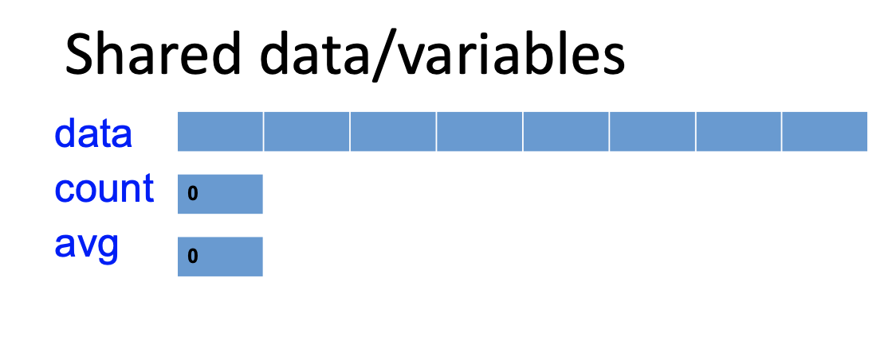
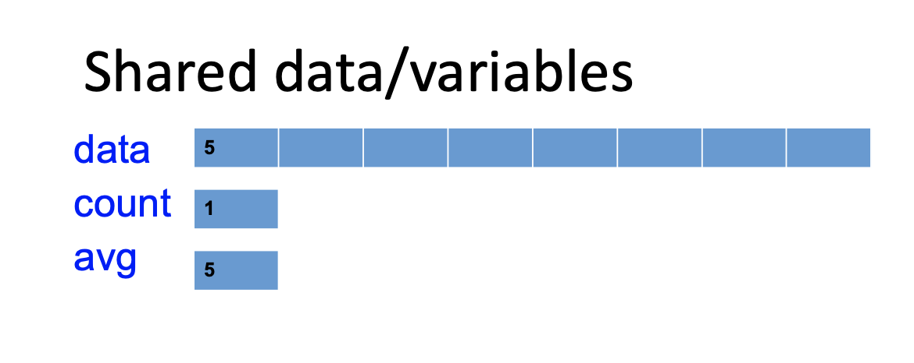

# Synchronization

## Concurrency

- Multiple processes/threads executing at the same time accessing a shared resource
  - Reading the same file/resource
  - Accessing shared memory

- Benifits of concurrency
  - Speed
  - Economics
- **Concurrency** is the interleaving of processes in time to give the appearance of simultaneous execution
  - Differs from parallelism, which offers genuine simultaneous execution
- **Parallelism** intrudroduces the ussue that different processors may run at different speeds
  - This problem is mirrored in concurrency as different processes progress at different rates 

- Condition for Concurrency

  - Must give the same results as serial execution 

  - Using shared data requires synchronization

- More tricky issue: 

  - C statements can compile into several machine language instructions

  - ```C
    //example
    count++;
    /*
    translates to:
    mov R2, count
    inc R2
    mov count, R2
    ```

  - If these low level instructions are *interleaved*, e.g. one process is preempted, and the other process is scheduled to run, then the rsults of the ***count*** value can be unpredictable

- How can various mechanisms be used to ensure the **orderly execution of cooperating processes** that share address space to that data consistency is maintained?

- Synchronization techniques:

  - Mutex
  - Semaphore
  - Condition Variable
  - Monitor

### Example: (Graphics)







### Code Examples

#### Serial Execution 

```C
//Waiting for data
while(true){
  v = get_value();
  add_new_value(v);
}
```

```C
//Process Data
add_new_value(v){
  int sum - avg * count +v;
  data[count] = v;
  count++;
  avg = (sum+v)/count;
}
```

#### Concurrent Execution

```C
//Process 1
//avg, data, count are global variables
while(true)
{
  v = get_value();
  add_new_value(v);
}
add_new_value(v){
  int sum - avg * count + v;
  data[count] = v;
  count++;
  avg = (sum+v)/count;
}
```

```C
//Process 2
//avg, data, count are global variables
while(true){
  v = get_value(v);
  add_new_value(v);
}
add_new_value(v){
  int sum = avg * count + v;
  data[count] = v;
  count++;
  avg = (sum+v)/count;
}
```

- Are we going to have data consistency?
- Correct values in all conditions?

### Race Condition

- Occurs in situations where: 
  - Two or more processes (or threads) are accessing a shared resource
  - And the final result **depends on the order of instructions** are executed
  - The part of the program where a shared resource is accessed is called a ***critical section***
  - We need a mechanism to ***prohibit*** multiple processes from accessing a shared resource at the same time

#### Critical Section (Code Example)

```C
//Process 1
//avg, data, count are global variables
while(true)
{
  v = get_value();
  add_new_value(v);
}
add_new_value(v){
  int sum - avg * count + v; //begin critical section
  data[count] = v;
  count++;
  avg = (sum+v)/count; //end critical section
}
```

```C
//Process 2
//avg, data, count are global variables
while(true){
  v = get_value(v);
  add_new_value(v);
}
add_new_value(v){
  int sum = avg * count + v; //begin critical section 
  data[count] = v;
  count++;
  avg = (sum+v)/count; //end critical section
}
```

### Race Condition: Solution

- Solution must satisfy the following conditions: 
  - Mutual exclusion
    - If process P<sub>i</sub> is executing in its critical section, then no other processes can be exucuting in their critical sections
  - Progress
    - If no process is executing in its critical section and some processes wish to enter their critical sections, then only those processes that wish to enter their critical setions can participate in the decision on which will enter its critical section next
    - This selection **cannot** be postponed indefinitely (OS must run a process, hence "progress")
  - Bounded waiting
    - There exists a bound, or limit, on the number of times other pricesses can enter their critical sextions after a process X has made a request to enter its critical section and before that request is granted (**no starvation**) 

## Producer-Consumer Problem

Also called the Bounded Buffer Problem

- Two processes (producer and consumer) share a fixed size buffer
- Producer puts new information in the buffer
- Consumer takes out information from the buffer


#### Shared Data


- Really no idea what is going on with this graphic

### Mutual Exclusion

- Mechanism to make sure no more than one process can execute in a critical section at any time
- How can we implement mutual exclusion?

#### Critical Section

```C
//Producer
while(1){
  produce (nextdata);
  while(count==MAX);
  //Enter critical sections
  buffer[count] = nextdata;
  count++;
  //Exit critical section
}
```

```C
//Consumer
while(1){
  while(count == 0);
  //enter critical section
  getdata = buffer[count-1];
  count--;
  //exit critical section
  consume(getdata)
}
```

#### Solution 1: Disabling Interrupts

- Ensure that when a process is executing in its critical section, it cannot be preempted
- Disable all interrupts before entering a CS
- Eneable all interrupts upon exitign the CS

```C
int count; // global
```

```C
//Producer
producer_code(){
  disable_interrupts();
  counter++;
  enable_interrupts();
  //remaining producer code
}
```

```C
//Consumer
consumer_code(){
  disable_interrupts();
  counter--;
  enable_interrupts();
  //remaining consumer code
}
```

- Problems:
  - If a user forgets to enable interrupts? 
  - Interrupts could be disabled arbitrarily long
  - Really only want to prevent p<sub>1</sub> and p<sub>2</sub> from interfering with one another; disabling interrupts ***blocks*** all processes
  - What to do if we have two or more CPUs?

### Solution 2: Software Only Solution

```C
shared boolean lock = FALSE; //global
shared int counter; //global
```

```C
//Code for producer

//acquire the lock
while(lock){no_op;}
lock = TRUE;

//excecute critical section
counter ++;

//release lock
lock = FALSE;
```

```C
//Code for consumer

//acquire the lock
while(lock){no_op;}
lock = TRUE;

//excecute critical section
counter ++;

//release lock
lock = FALSE;
```

- A flawed lock implementation:
  - Both processes may enter their critical section if there is a context switch just before the <lock = TRUE> statement
- Implementing mutual exclusion in software is not hard, but it does not always work
- Need help from hardware
- Modern processors provide such support
  - Atomic test && set instruction
  - Atomic compare and swap instruction

#### Peterson's Solution

- Restricted to only 2 processes

```C
int turn;
boolean flag[2];
do{
  flag[i] = true;
  turn = j;
  while(flag[j] && turn == j);
  //critical section
  flag[i] = false;
  //remainder section
}while(true);
```

- turn indicates who will be run next
- Flag indicates who is ready to run next
- Need to prove:
  - Mutual exclusion is preserved
  - Progress is made
  - Bounded-waiting is met

### Solution 3: Mutual Exclusion using TS

#### Atomic Test and Set

- Need to be able to look at a variable and set it up to some value wihout being interrupted

  - `y = read(x); x = value;`

- Modern computing systems provide such an instruction called *test-and-set* (TS)

  ```C
  boolean TS(boolean *target){
    boolean rv = *target;
    *target = TRUE;
    return rv; //returns original value of the target
  }
  ```

- The entire sequence is a single instruction (atomic) implemented in the hardware

```C
shared boolean lock = FALSE;
shared int counter;
```

```C
//code for p_1

//acquire the lock
while(TS(&lock));
//exeute critical section
counter++;
//release lock
lock=FALSEl
```

```C
//code for p_2

//acquire the lock
while(TS(&lock));
//exeute critical section
counter++;
//release lock
lock=FALSEl
```

- The boolean TS() instruction is essentially a swap of values
- Mutual exclusion is achieved - no race conditions
  - If one process X tries to obtain the lock while another process Y already has it, X will wait in the loop
  - If a process is testing and/or setting the lock, no other process can interrupt it
- The system is exclusively occupied for only a short time - the time to test and set the lock, and not for entire critical seciton
- Don't have to disable and reenable interrupts
- Do you see any problems?
  - Busy waiting `while(TS(&lock));`
- Slides walk through the following code instruction by instruction

```C
shared boolean lock = FALSE;
shared int count;
shared data_type buffer[MAX];
```

```C
//code for p_1

while(1){
  produce(nextdata);
  while(count==MAX);
  acquire(lock);
  buffer[count] = nextdata;
  count++;
  realease(lock);
}
```

```C
//code for p_2

while(1){
  produce(nextdata);
  while(count==MAX);
  acquire(lock);
  buffer[count] = nextdata;
  count++;
  realease(lock);
}
```

- How can we eliminate the *busy waiting*?
- Need a way to pause a process/thread until the lock is available

#### `sleep()` and `wakeup()` Primitives

- `sleep()`: causes a running process to block
- `wakeup(pid)`: causes the process who's id is pid to move to ready state
  - No effect if process pid is not blocked

```C
//producer - place data into buffer
while(1){
  if (counter==MAX){sleep();}
  buffer[in] = nextdata;
  in = (in+1)%MAX;
  counter++;
  if(counter == 1){wakeup(p2);}
}


//consuner - take data out of buffer
while(1){
  if(counter == 0){sleep();}
  get data = buffer[out];
  out = (out+1)% MAX;
  counter --;
  if(counter == MAX -1){wakeup(p1);}
}
```

- Problem with counter++ and counter-- still exist
  - Can be solved using TS but it has busy waiting 
- Possible problem with order of execution: 
  - Consumer reads counter and counter == 0;
  - Scheduler schedules the producer
  - Producer puts an item in the buffer and signals the consumer to wake up
    - Sicne consumer has not yet invoked `sleep()`, and `wakeup()`invocation by the producer has no effect
  - Consumer is scheduled, and it blocks
  - Eventually, producer fills up the buffer and blocks
  - How can we solve this problem?
    - Need a mechanism to count the number of `sleep()` and `wakeup()` functions 


# Aside on Semaphores 

- Read textbook section on semaphores
- key to lab 3
- lab three solution (essentially) posted in semaphore lecture notes?

# Rule of Thumb for Function Lengths

- Keep viewable on 1 page, ~24 lines