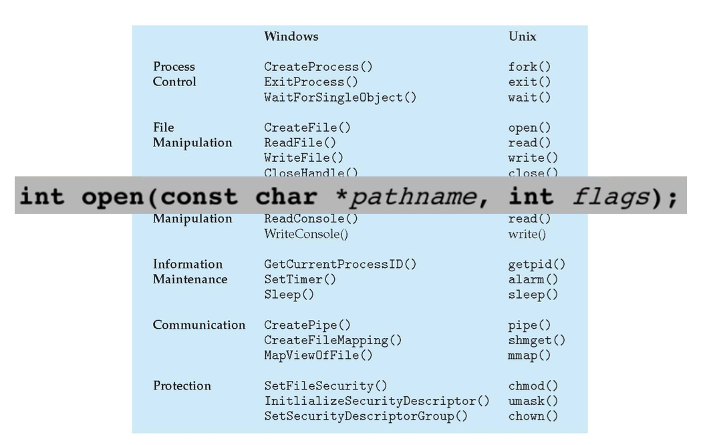

# Operating Systems

### 

### What does an operating system provide? 

**Definition** An operating system is a layer of software between *many* applications and *diverse* hardware that:

1) Provides a ***hardware abstraction*** so an application doesn't have to know the details about the hardware - e.g. an application saving a file to disk doesn't have to know how to disk operates
2) **Arbitrates access** to resources among multiple applications

### Protection in Operating Systems

1) Prevent applications from writing into privileged memory, e.g. of another app or OS kernel
2) Prevent applications from invoking privledges functions, e.g. OS kernel functions, e.g.
   - Memory address mapping
   - Flush or invalidate data cache
   - Invalidate TLB entries
   - Load and read system registers
   - Change processor modes from K to U
   - Change the voltage and frequency of processors
   - Halt / reset processor
   - Perform I/O operations

### What is a Unit of Work for an OS?

- Application
- Task
  - Code - placed into memory
  - Data - stored into memory
  - OS data for task - task descriptors
- Job
- Process

### How can we Access the OS Functionality?

- **Problem**: if a task is protected from getting into the OS code and data, OS functionality are restricted from these tasks
- How does CPU know if an certain instruction should be allowed? 
- How does OS grant a task access to certain OS data structures but not the other?
- How to switch from running the task's code to running OS's code?
- Need to use a hardware assistant called **mode bit**

## Kernel Mode vs User Mode

- Processors include a hardware mode bit that identifies whether the system is in *user* mode or *supervisor/kernel* mode
  - Requires extra support from the CPU hardware for this OS feature
- Supervisor or kernel mode (mode bit = 0)
  - Can execute all machine isntructions, including privledged instructions
  - Can reference all memory locations
  - Kernel executes in this mode
- User mode(mode bit = 1)
  - Can only execute a subset of non-priveleged instructions
  - Can only reference a subset of memory locations
  - All applications run in user mode

 ### Multiple Rings / Modes of Privilege

- Intel x86 CPUs support four modes or rings of privilege

- Common configuration:

  - OS like Linux or Windows runs in ring 0 (highest privledge), apps run in ring 3, && rings 1-2 are unused

- Virtual machines (one possible configuration)

  - VM's hypervisor runs in ring 0, guest OS runs in ring 1 or 2, apps run in ring 3

  

  

# System Calls

How Apps and the OS Communicate 

## The `trap` Instruction

- The `trap` instruction is used to switch from user to kernel mode, thereby entering the OS
  - `trap` sets mode bit to 0
  - On x86, use `INT` assembly instruction (more recently called `SYSCALL/SYSENTER`)
  - Mode bit set back to 1 on return
- Any instruction that invokes `trap` is a system call
  - There are many different classes of system calls

### API - System Call - OS Relationship

### Trap Table

- Trap handling: The process of indexing into the trap table to jump to the trap handler routine is also called sipatching
- The trap table is also called a *jump table* or *branch table*
- A trap is a 'software interrupt'
- Trap handler (or system call handler) performs the specific processing desired by the system call / trap

### Classes of System Calls Invoked by `trap`

### Standard C Library Example

- C program invoking `printf()` library call, which calls `write()` system call:

  

  ​												E.g, `INT` or `SYSCALL`

### Examples of Windows and Unix System Calls: 

### Passing Parameters to System Call:

